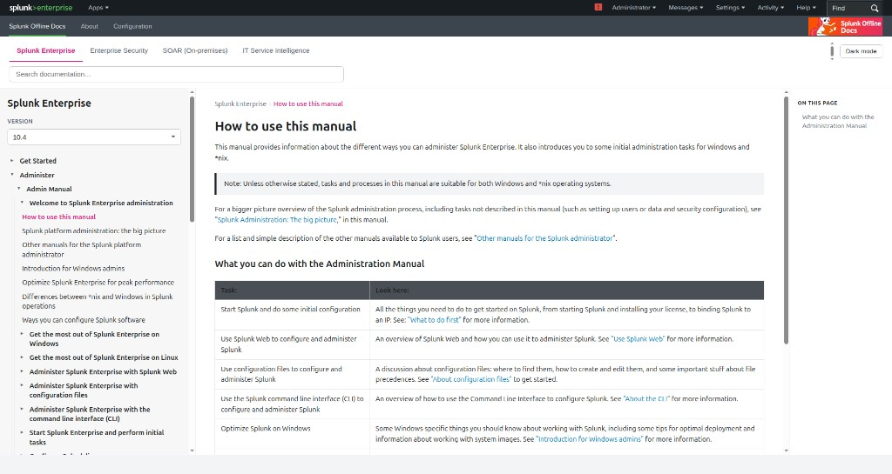
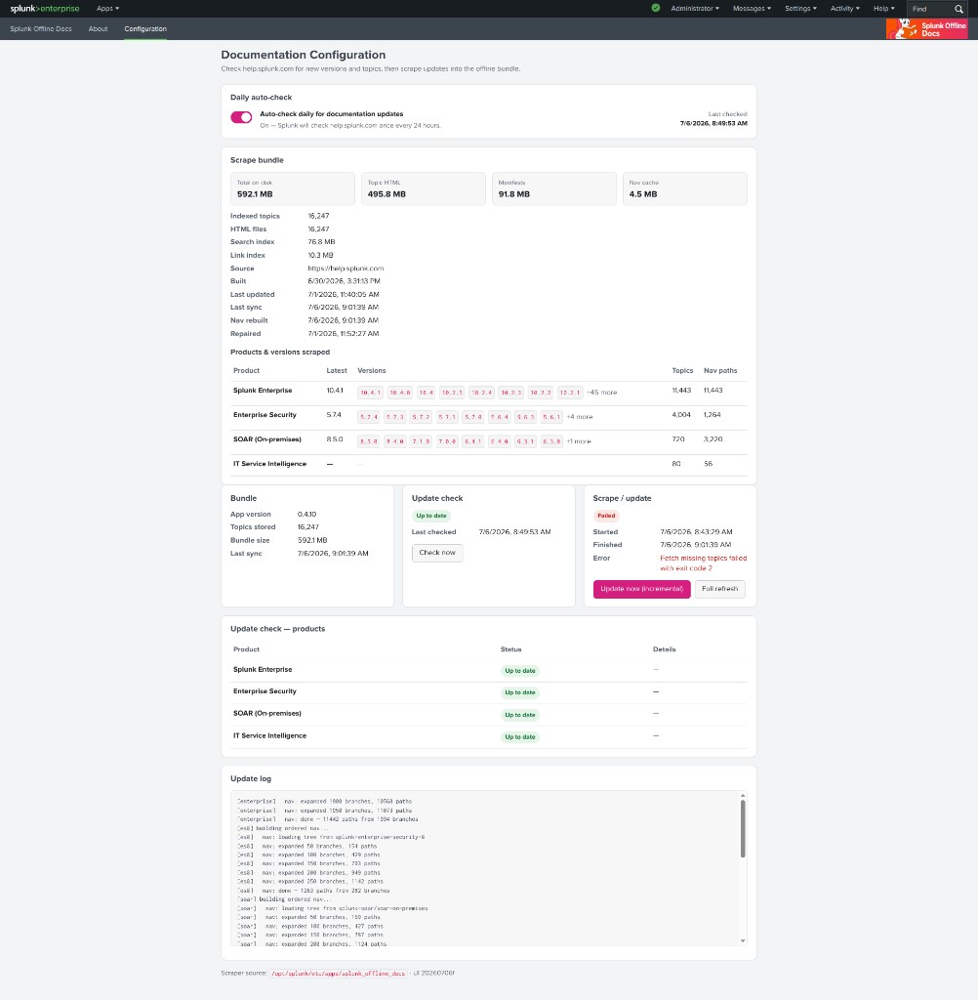
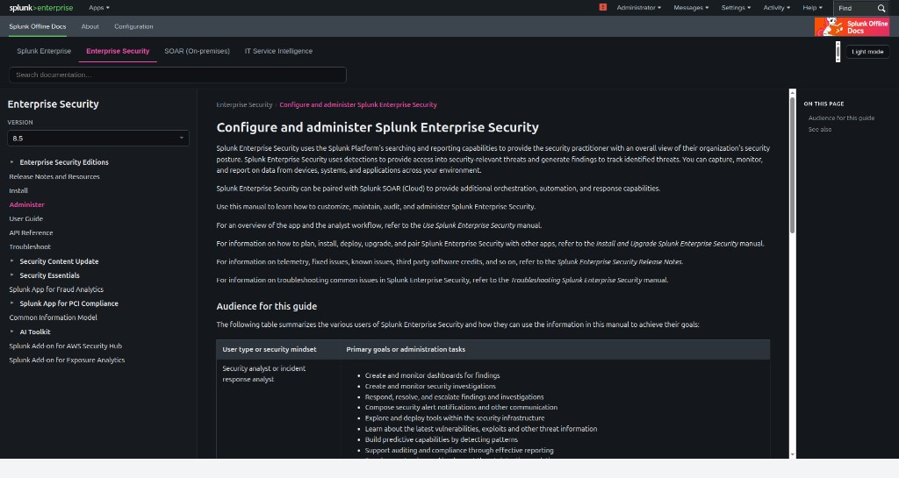
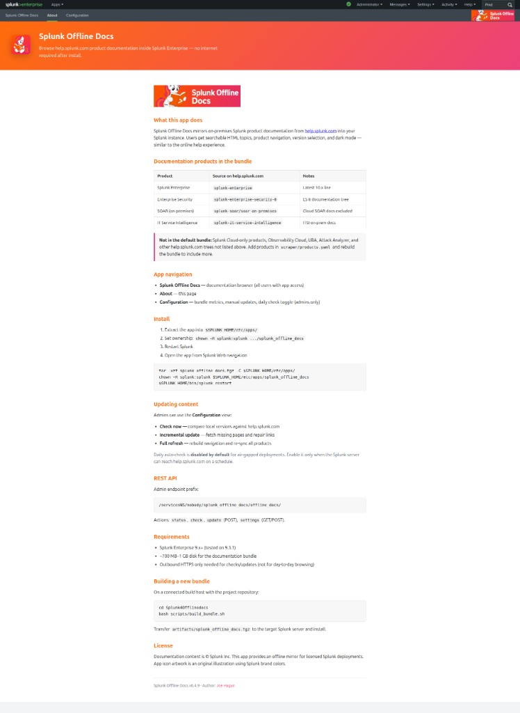

# Splunk Offline Docs

**Browse [help.splunk.com](https://help.splunk.com) inside Splunk Enterprise — with no internet after install.**

A Splunk app for **air-gapped and restricted networks**. It ships a pre-built copy of Splunk product documentation (search, navigation, version picker, dark mode) so admins and users get the same experience as the online help site without outbound HTTPS for day-to-day use.

<p align="center">
  
</p>

**Author:** [Joe Hagan](mailto:joehaga@cisco.com)

## Screenshots

| Documentation browser | Configuration (updates) |
|---|---|
|  |  |

| Dark mode | About |
|---|---|
|  |  |

## What you get

- **Splunk Enterprise** (10.x), **Enterprise Security 8**, **SOAR** (on-premises, latest 2), **ITSI** (latest 2, e.g. 5.0 + 4.21) — ~16k+ HTML topics
- Full-text **search**, product **tabs**, **version** dropdowns, and **offline link resolution**
- **Configuration** view: check for updates, incremental/full scrape, daily auto-check toggle
- **About** view with install and admin reference

## Download (air-gapped ready)

Use the **full release tarball** — documentation included. No scraper or internet needed to install.

1. **[Releases](https://github.com/gosplunk/splunk-offline-docs/releases)** → download `splunk_offline_docs_full.tgz` (latest: **v0.4.11+**)
2. Install:

```bash
tar -xzf splunk_offline_docs_full.tgz -C $SPLUNK_HOME/etc/apps/
chown -R splunk:splunk $SPLUNK_HOME/etc/apps/splunk_offline_docs
$SPLUNK_HOME/bin/splunk restart
```

3. Open **Splunk Offline Docs** in Splunk Web.

> Developers rebuilding from source use `splunk_offline_docs.tgz` (app only, no docs). Air-gapped sites should always use **`splunk_offline_docs_full.tgz`**.

## Requirements

- Splunk Enterprise **9.x+**
- ~**625 MB** disk for the installed app + documentation bundle

## Optional: update from help.splunk.com

If the Splunk server can reach the internet, admins use **Configuration**:

| Action | What it does |
|--------|----------------|
| **Check now** | Compare local docs vs help.splunk.com |
| **Update now** | Fetch missing topics and repair links |
| **Full refresh** | Rebuild navigation and re-scrape all products |
| **Daily auto-check** | Scheduled check every 24h (off by default for air-gapped hosts) |

SOAR and ITSI bundles keep the **two newest doc versions** from help.splunk.com (not a fixed pair). After upgrading to v0.4.11+, run **Full refresh** once so ITSI picks up current releases (e.g. 5.0 and 4.21).

## Build from source (connected hosts)

```bash
git clone https://github.com/gosplunk/splunk-offline-docs.git
cd splunk-offline-docs
bash scripts/build_bundle.sh
bash scripts/package_release.sh
```

## Documentation

| Location | Audience |
|----------|----------|
| [splunk_offline_docs/README](splunk_offline_docs/README) | Splunk admins |
| **About** view in Splunk Web | All users |
| **Configuration** view | Admins |

## Legal

- **App code** — [Apache License 2.0](LICENSE)
- **Documentation HTML** from help.splunk.com — © Splunk Inc.; for licensed Splunk deployments per Splunk documentation terms
- Splunk® and related marks are trademarks of Splunk Inc.

## Support

[Joe Hagan](mailto:joehaga@cisco.com)
